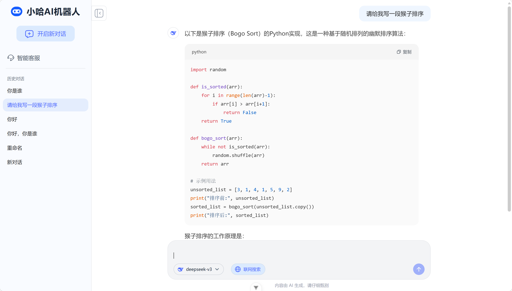
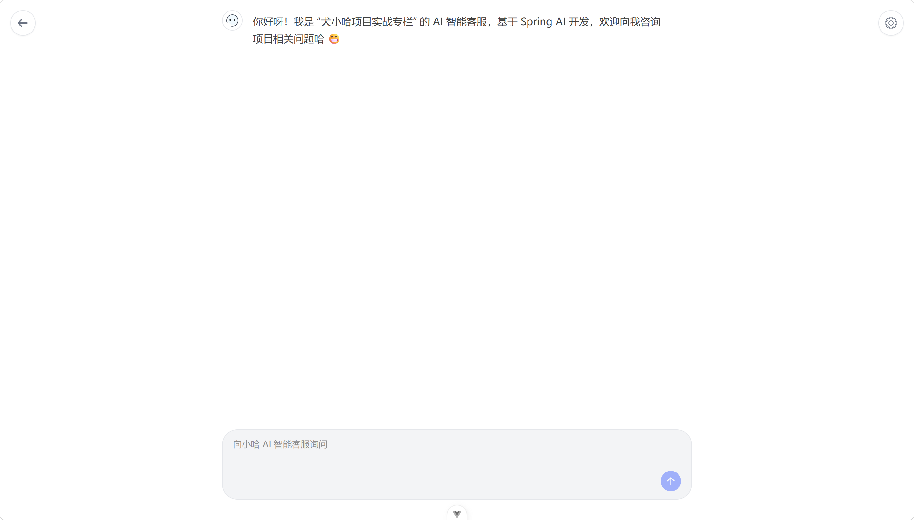
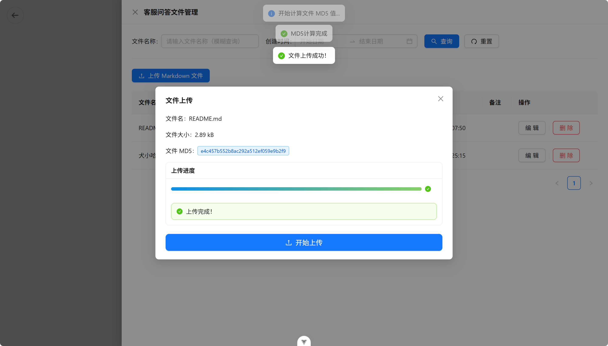

<h1 align="center">🤖 AiRobot</h1>
<p align="center">
  <b>基于 Spring AI 的智能对话平台 · 通用聊天机器人 & 私有知识库智能客服</b>
</p>

<p align="center">
  
  
  
  
  
  
  
</p>

---

## 📖 项目简介

AiRobot 是一套基于 **Spring AI** 框架构建的智能对话平台，核心包含两套 AI 应用：

| 应用 | 说明 |
|------|------|
| **通用聊天机器人** | 支持长上下文记忆、联网实时搜索，提供类 ChatGPT 的对话体验 |
| **智能客服（RAG）** | 基于私有知识库的检索增强生成，按指定语料精准回答，杜绝幻觉 |

项目采用 **Advisor 链架构**，将对话记忆注入、RAG 检索增强、联网搜索等能力抽象为可插拔组件，实现了高度的模块化与可扩展性。

---

## 📸 界面预览








---

## ✨ 核心特性

### 🧠 长上下文对话记忆
- 基于 **PostgreSQL + pgvector** 实现**一库两用**（业务存储 + 向量存储），无需额外引入独立向量数据库
- 自定义 **Memory Advisor**：每次模型调用前后自动注入历史对话上下文，消息完整持久化
- 同时收集流式（SSE）与非流式响应，为审计与分析提供完整数据链路

### 🔍 联网实时搜索
- Docker 自部署 **SearXNG** 聚合搜索引擎，无 API 费用，隐私可控
- **OkHttp3 + CompletableFuture + 自定义线程池** 实现多源并发请求
- **Jsoup** 清洗网页正文（去广告 / 导航栏 / 脚本），**Token 消耗降低 60%+**
- 使 AI 具备实时、准确的外部信息获取能力

### 📚 RAG 检索增强生成
- 自定义 **RAG Advisor**，检索 pgvector 中的私有知识库向量数据
- 动态构建增强 Prompt 模板，约束模型仅基于检索到的知识回答
- 支持 Markdown 文件自动解析、切片、向量化（Spring Event 异步解耦）

### 🎯 提示词工程
- 多场景 Prompt 模板：联网搜索场景、客服问答场景
- 角色设定 + 规则约束 + 上下文管理，显著提升模型输出准确性与一致性

### 📤 大文件分片上传
- 前端 **MD5 计算** 文件指纹，实现**秒传**（已存在文件直接跳过）
- **分片上传 + 断点续传**：后端返回已上传分片列表，前端仅补传缺失分片
- 并发分批上传 + 失败自动重试，大幅提升稳定性

### 🎨 现代化前端
- **Vue 3 + Vite 4** 构建，响应式单页应用
- **Ant Design Vue + Tailwind CSS** 双轨样式，风格统一
- **SSE 流式响应**：封装 `EventSource` / `fetch-event-source`，实时渲染流式 Markdown
- **Pinia** 全局状态管理（模型选择、搜索开关、对话列表）
- 滚动分页加载聊天记录与对话列表

---

## 🛠️ 技术栈

| 层级 | 技术 | 说明 |
|------|------|------|
| **后端框架** | Spring Boot 3.x | 核心应用框架 |
| **语言** | JDK 21 | 支持虚拟线程（Virtual Threads） |
| **AI 框架** | Spring AI | Advisor 链、流式调用、Prompt 模板 |
| **大模型** | DeepSeek | 低成本、强中文能力 |
| **ORM** | MyBatis Plus | 数据库访问层 |
| **数据库** | PostgreSQL + pgvector | 业务数据 + 向量存储 |
| **搜索引擎** | SearXNG (Docker) | 聚合搜索，隐私可控 |
| **HTTP 客户端** | OkHttp3 | 高并发外部请求 |
| **HTML 解析** | Jsoup | 网页正文清洗 |
| **异步处理** | Spring Event + CompletableFuture | 文件处理解耦 + 并发搜索 |
| **容器化** | Docker / Docker Compose | 一键部署 |
| **前端框架** | Vue 3 + Vite 4 | 响应式 SPA |
| **UI 组件** | Ant Design Vue + Tailwind CSS | 组件库 + 原子化 CSS |
| **状态管理** | Pinia | 全局状态 |
| **流式通信** | SSE (EventSource) | 流式 Markdown 实时渲染 |
| **HTTP 客户端** | Axios | 前端 API 请求 |

---

## 🚀 快速开始

### 环境要求

| 依赖 | 版本 |
|------|------|
| JDK | 21+ |
| Node.js | 18+ |
| Docker & Docker Compose | 最新版 |
| PostgreSQL | 16+（需安装 pgvector 扩展） |

### 克隆项目

```bash
git clone https://github.com/P1uto-v/AiRobot.git
cd AiRobot

cd docker
docker-compose up -d searxng

-- 创建数据库
CREATE DATABASE airobot;

-- 启用 pgvector 扩展
CREATE EXTENSION IF NOT EXISTS vector;

-- 创建向量表（Flyway / 启动时自动建表）

cd airobot-server
./mvnw spring-boot:run -Dspring-boot.run.profiles=dev

cd airobot-web
pnpm install    # 或 npm install
pnpm dev

```

---

## 🔑 核心模块详解

### Advisor 链设计

项目最核心的架构设计，三个自定义 Advisor 按序执行：

用户消息 → MemoryAdvisor → RagAdvisor → WebSearchAdvisor → DeepSeek → 流式返回
                     │               │               │
                     ▼            ▼               ▼
       注入历史对话      检索知识库       聚合搜索结果
       到 Prompt         注入 Prompt      注入 Prompt
